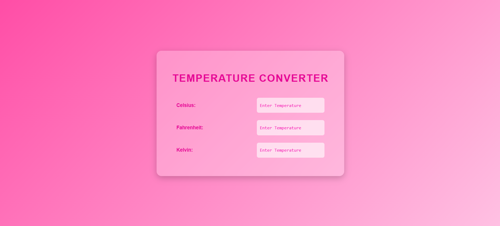

# 🌡️ Temperature Converter

A modern and responsive **Temperature Converter Web App** that allows users to convert temperatures between:

* Celsius
* Fahrenheit
* Kelvin

Built using **HTML, CSS, and JavaScript** with a clean glassmorphism UI design.

---

## ✨ Features

* 🔄 Real-time temperature conversion
* 🎨 Modern gradient + glassmorphism design
* 📱 Responsive layout
* ⚡ Instant updates using JavaScript
* 💡 Clean and beginner-friendly code structure

---

## 🛠️ Technologies Used

* **HTML5**
* **CSS3** (Flexbox, Gradient Background, Blur Effect)
* **JavaScript (Vanilla JS)**

---

## 📂 Project Structure

temperature-converter/
│
├── index.html
├── style.css
└── script.js

---

## 🚀 How It Works

* User enters temperature in any one input field.
* JavaScript detects which field was updated.
* Other two units are automatically calculated.
* Uses standard conversion formulas:

```
Celsius → Fahrenheit: (C × 1.8) + 32  
Celsius → Kelvin: C + 273.32  

Fahrenheit → Celsius: (F - 32) / 1.8  
Kelvin → Celsius: K - 273.32  
```

---

## 📸 UI Preview

Modern pink gradient background with a blurred glass container and styled input fields.



---

## 🔧 How to Run Locally

1. Clone the repository:

```
git clone https://github.com/your-username/temperature-converter.git
```

2. Open the project folder.
3. Double-click `index.html`.

That’s it 🎉

---

## 👩‍💻 Author
Noshin Nawar

